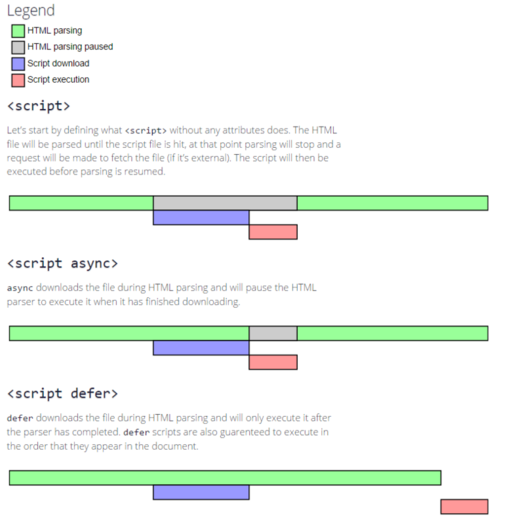

# [JavaScript 高级程序设计](../README.md)

## 第二章 HTML 中的 JavaScript

- [使用`<script>`元素](#aa)
- [行内脚本与外部脚本的比较](#bb)
- 文档模式对 JavaScript 有什么影响  
  通过`<!DOCTYPE html>`这类 DTD 来定义文档模式，告知浏览器应该用怎样的标准来解析前端代码
- 确保 JavaScript 不可用时的用户体验  
  使用`<noscript>`标签，在`<noscript>`中可以使用任何`HTML`标签,`<script>`标签除外

### `<script>`元素

- `<script>`元素有下列 8 个属性

* async：可选。表示应该立即下载脚本，但不能阻止当前页面其他动作，比如下载资源或者等待其他脚本加载。_只对外部脚本文件有效_
  - 不能保证多个外部脚本执行的先后顺序
  - 适用于，不修改 dom，不与其他脚本存在依赖的外部脚本文件
* defer：可选。表示脚本可以延迟到文档完全被解析或者显示之后再执行。_只对外部脚本文件有效_
  - 宿主环境的具体实现上，也是不能保证多个外部脚本按照先后顺序进行解释
    
* src: 可选。表示包含要执行的代码外部文件。
* charset: 可选。使用 src 属性指定的代码字符集。这个属性很少使用，因为大多数浏览器不在乎它的值
* crossorigin：可选，配置相关请求的 CORS(跨源资源共享)设置。默认不使用 CORS。
* integrity：可选，允许比对接受到的资源和指定的加密签名以验证子资源完整性。
* language：废弃
* type: 可选，代替 language，表示代码块中脚本语言的内容类型（也称 MIME 类型）。如果这个值是`module`，则代码会被当做 ES6 模块，而且只有这时候代码中才能出现`import`和`export`关键字。

- 浏览器会按照`<script>`再页面中出现的顺序依次解释它们，前提是他们没有使用`defer`和`async`属性，第二个`<script>`元素的代码必须在第一个`<script>`元素的代码解释完毕才能开始解释，第三个则必须等第二个解释完，以此类推

引申： ESModule 静态模块，commonjs 动态模块

### 行内代码与外部文件

- 推荐使用外部文件理由

* 可维护性
* 缓存
* 适应未来
