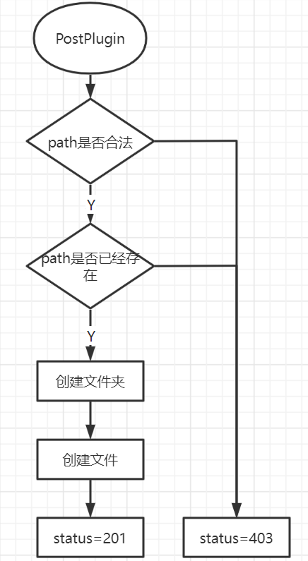

# http demo

基于 node 库中 net 包来实现应用层的 http 协议

## 模块

### main 模块

tcp 采用字节流(Socket)进行数据的传递

```typescript
// main.ts
import net from "node:net";
import work from "work";
net.createServer((connection: Socket) => {
  worker(connection);
});
```

### worker 模块

接受到 Socket,将 Socket 进行拼接，获取相关信息。http 报文时放在 tcp 报文里面，到达 net 时 Socket 里面只剩下 http 的请求报文

```typescript
// worker.ts
function worker(connection: Socket) {
  // 将二进制流进行拼接，获取到完整的http请求报文后，返回响应报文，借用一个HttpParser类来处理
  const httpParser = new HttpParser();
  connection.on("data", (buffer: Buffer) => {
    // 将二进制流进行拼接
    httpParser.append(buffer);
  });
  // 获取到完整的http请求报文后，进行
  httpParser.on("finish", (message) => {
    // 处理响应报文，返回
    const response = makeResponse(message);
    connection.end(response);
  });
}
```

#### HttpParser 模块

```typescript
// HttpParser.ts
// 使用事件的on、emit方法，借用node模块的events
import EventEmitter from "node:events"
class HttpParser {
  // 使用有限状态机，处理line、headers、body
  this._status = this._parseRequestLine
  // 存储解析后的请求报文、响应数据
  this.message
  append(buffer: Buffer) {
    buffer.forEach((char: number) => { // 遍历Buffer，每个都是二进制数据
      this.status = this.status(char)
    });
  }
  _parseRequestLine(char: number) {
    // ...code
    // 将二进制数据转化为对应的字符串
    String.fromCharCode(char)
    // ...code
    return this._parseRequestHeaders
  }
  _parseRequestHeaders(char: number) {
    // ...code
    return this._parseRequestBody
  }
  _parseRequestBody(char: number) {

  }
  finish() {
    this.emit("finish", message)
  }
}
```

### makeResponse 模块

```typescript
// makeResponse.ts
function makeResponse(message) {
  const responseLine = `${message.request.version} ${message.response.status} ${status message}\r\n`
  // ...code
  return Buffer.concat([
    Buffer.from(responseLine),
    Buffer.from(responseHeaders),
    Buffer.from("\r\n", "ascii"),
    message.response.body
  ])
}

```

## 插件

### postPlugin

判断 method 是否为 post 请求，然后，根据请求路径创建对应文件

- 流程图  
  

### getPlugin

- 获取部分内容
  - 状态码  
    206(Partial Content): 成功返回部分内容
    416(Range Not Satisfiable): Range 请求头不符合规范
  - 关键点
    `fs.openSync`打开一个文件返回一个标识码  
    `fs.readSync`读出文件，存到一个 Buffer 中
    `fs.closeSync`关闭文件

### putPlugin

### delPlugin

`fs.unlinkSync`删除文件

## 应用

### 访问授权

使用 http + 浏览器默认的登录界面实现用户权限
响应头: WWW-Authenticate
请求头: Authorization

### 跨域

- 简单请求:
- 复杂请求:

### http 缓存

- 强缓存
  响应头: Cache-Control/Expires
  请求头: -
- 协商缓存
  响应头: ETag/Last-Modified
  请求头: If-Not-Match/If-Modified-Since
