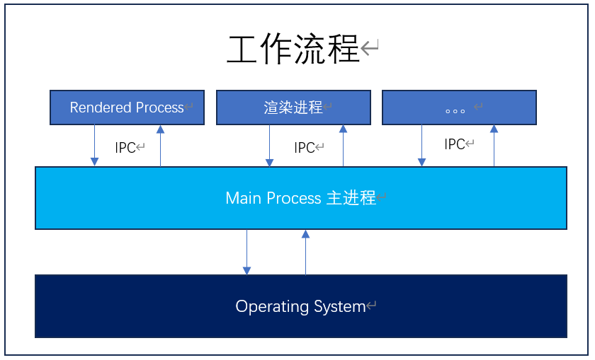

# electron

## 内容概述

## 技术架构

::: tip  
chromium + Node + native Api
:::

chromium: 展示界面，支持最新特性的浏览器  
node：文件操作，javascript 运行时，可实现文件读写等  
native apis：操作 os，提供统一的原生界面能力

## 工作流程


主进程：通过 Native Apis 跟操作系统进行交互  
渲染进程： 每一个 window 窗口，都是一个渲染进程

## 环境搭建

在 github 中 clone electron-quick-start  
electron 工程中，node 环境不要使用 ESModule，因为 electron 中使用的时 commonjs

## 生命周期

- app 的生命周期  
  `ready`: app 初始化完成时，调用  
  `dom-ready`: 当页面内容加载完成时，调用  
  `did-finish-load`：当导航加载完成时，调用  
  `window-all-close`：当所有的窗口关闭时，调用  
  `before-quit`: 当程序退出前，调用  
  `will-quit`: 当程序  
  `quit`: 当程序退出时调用  
  `close`: 当前窗口关闭时，调用

::: info
当没有监听`app.on('window-all-close')`时，自动调用`app.quit()`  
没有调用`app.quit()`，程序不会退出，但是窗口可能已经全部关闭
:::

## 窗口尺寸

```js
new BrowserWindow({
  show: false, // dom没渲染完成时，不展示窗口
  frame: false, // 用于自定义menu，设置为false可以将默认的菜单栏隐藏
  autoHideMenuBar: true, //
  title: "", // 当html文件中<title></title>为空时，获取到当前属性
  icon: "", // 设置app图标
  x: 0,
  y: 0, // 窗口位于桌面的位置
  width: 800,
  height: 600, // 窗口的默认宽高
  maxWidth: 1000,
  maxHeight: 800, // 窗口可拖拽的最大宽高，也是窗口最大化的尺寸
  minWidth: 300,
  minHeight: 100, // 窗口可拖拽的最小宽高
  resizable: false, // 窗口是否可缩放，设置为false时，窗口也无法最大化
  webPreferences: {
    // 渲染进程中的网页的偏好设置
    nodeIntegration: true, // 集成node环境
    contextIsolation: false,
    enableRemoteModule: true, // 允许remote模块
  },
});
```

## 窗口标题及环境

- 如何打开一个新的窗口(渲染进程)  
  借用 remote 模块实现渲染进程跟主进程之间的交互
  ::: warning
  electron 版本 < 10 remote 模块集成在 electron 中  
  electron 版本 >= 10 remote 独立于@electron/remote 中  
  :::

  ::: info
  electron 版本 < 14 需要配置 webPreference: { enableRemoteModule: true }  
  electron 版本 >= 14 使用 require('@electron/remote/main').enable(webContents)  
  :::

```js

```

## 自定义窗口

```js
// 获取当前窗口
const currentWin = remote.getCurrentWindow();
// 关闭当前窗口
currentWin.close();
// 当前窗口是否最大化
currentWin.isMaximized();
// 当前窗口，最大化
currentWin.maximize();
// 当前窗口还原
currentWin.restore();
// 当前窗口，是否最小化
currentWin.isMinimized();
// 当前窗口，最小化
currentWin.minimize();
```

## 阻止窗口关闭

```js
window.addEventListener("beforeUnload", () => {
  const currentWin = remote.getCurrentWindow();
  currentWin.destroy(); // close方法，会再次触发beforeUnload，destroy不会再次触发beforeUnload，直接销毁window
});
```

## 父子及模态窗口

```js
new remote.browserWindow({
  parent: remote.getCurrentWindow(), // 确认父子关系，父窗口关闭后，子窗口也会同步关闭
  width: 300,
  height: 200,
  modal: true, // 是否为模态窗，即打开新窗口时，父窗口不允许操作,默认是false
});
```

## 自定义菜单

::: warning
Menu.setApplicationMenu() 会导致快捷键失效，因为取消了 electron 的默认菜单，导致快捷键失效  
使用 mainWindow.viewContents.openDevTools()自动打开控制台  
:::

```js
const { Menu } = require("electron");
Menu.buildFromTemplate([{ label: "", subMenu: [] }]);
Menu.SetApplicationMenu(menu);
```

## 菜单角色及类型

```js
[
  {
    label: "操作",
    submenu: [
      {
        label: "打开",
        accelerator: "ctrl+o",
        click() {
          console.log("打开文件");
        },
      },
      {
        label: "复制",
        role: "copy",
      },
      {
        label: "剪切",
        role: "cut",
      },
      {
        label: "粘贴",
        role: "paste",
      },
      { label: "分割符", type: "separator" },
      { label: "关闭", role: "close" },
    ],
  },
  {
    label: "类型",
    submenu: [
      {
        label: "选项一",
        type: "checkbox",
      },
      {
        label: "选项二",
        type: "checkbox",
      },
      { type: "separator" },
      {
        label: "Yes",
        type: "radio",
      },
      {
        label: "No",
        type: "radio",
      },
      { type: "separator" },
      {
        label: "子菜单",
        type: "submenu",
        role: "windowMenu",
      },
    ],
  },
];
```

## 动态创建菜单

- 使用实例化得方法创建`Menu`

```js
const menu = new Menu();
// 创建菜单项, 不存在submenu时，需要加上type，不然显示会异常
const menuItem1 = new MenuItem({ label: "xxx", type: "normal" });
menu.append(menuItem1);
Menu.setApplicationMenu(menu);
```

- 使用`buildFromTemplate`静态方法创建`Menu`

```js
const menu = Menu.buildFromTemplate([{ label: "xxxx" }]);
menu.append(new MenuItem({ label: "yyy" }));
Menu.setApplicationMenu(menu);
```

## 自定义右键菜单

```js
const menu = remote.Menu.buildFromTemplate();
menu.popup({ window: remote.getCurrentWindow() });
```

## 主进程与渲染进程通信

- 通过`ipcRender`和`ipcMain`进行主进程与渲染进程之间通信
- 通过`webContents`和`ipcRender`进行渲染进程之间的通信

## dialog

## shell 与 iframe

## 消息通知

```js
new window.Notification("title", { body: "", icon: "" });
```

## 快捷键注册

```js
globalShortcut.register("Control+X", () => {});
```

在`will-quite`事件中取消快捷键

## 剪切板模块

- 文本

```js
const { clipboard } = require("electron");
// 写入文本
const flag = clipboard.writeText("");
// 粘贴文本
clipboard.readText(flag);
```

- 图片

```js
const path = require("node:path");
const { nativeImage } = require("electron");
const icon = nativeImage.createFromPath(path.resolve());
```

## 项目初始化

- 使用第三方包
  `concurrently`: 链接多个命令  
  `wait-on`: 等待某个结果执行之后再去执行后续的命令
  `cross-env`: 跨平台注入环境变量

```json
{
  "scripts": {
    "dev": "concurrently \"cross-env BROWSER=none npm run start\" \"wait-on http://localhost:3000/ && electron .\""
  }
}
```
