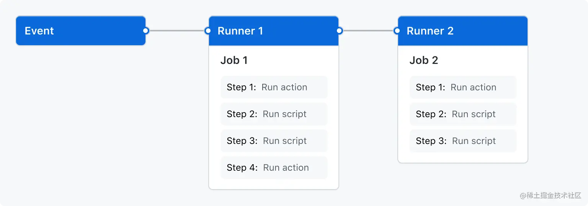

# CI/CD

## 概述

ci/cd：就是提交代码，触发 github action，github action 根据 workflow 命令经行自动化处理。比如，代码合入前的单元测试，代码合入后的构建以及部署。

## 什么是 CI?

ci(Continuous Integration)就是持续集成，当代码仓库代码发生变更，就会自动对代码进行测试和构建，最后反馈运行结果。运行结果通过后，才会将代码合并到对应的分支上。

## 什么是 CD?

cd(Continuous Delivery)就是持续交付，持续交付是在持续集成的基础上，可以将集成后的代码依次部署到相对应的环境中。

### 配置 GitHub ci action

1. 当想往项目中接入 Github Actions 时，需要在根项目中新建.action/workflows 目录
2. 通过编写`yml`文件格式, 定义**Workflow**去实现`CI`。 workflow 相关概念  
   2.1 **Event**(触发事件)：指触发 Workflow 运行的事件  
   2.2 **Job**(作业)： 一个工作流程中包含一个或者多个 Job，这些 Job 默认情况下并行运行，但我们也可以通过设置让其按顺序执行。每个 Job 都在指定的环境(虚拟机或者容器)里开启一个**Runner**(可以理解为一个进程)运行，包含多个**Step**(步骤)。  
   2.3 **Step**(步骤)：Job 的组成部分，用于定义每一步的工作内容。每个 step 在运行环境中以其单独的进程运行，且可以访问工作区和文件系统



```yml
# 指定工作流程的名称
name: learn-github-actions
# 指定此工作流程的触发事件Event
on: [push]
# 存放 learn-github-actions工作流程中的所有job
jobs:
```

3. 在 cl.yml 配置相关命令，主要 name, on, job

## cd

### 什么是 cd

cd(Continuous Delivery)就是持续交付，可以在持续集成的基础上，可以将集成后的代码依次部署到测试环境、生产环境等

docker 部署流程
build 打包 -> docker build 生成镜像 -> 运行镜像
