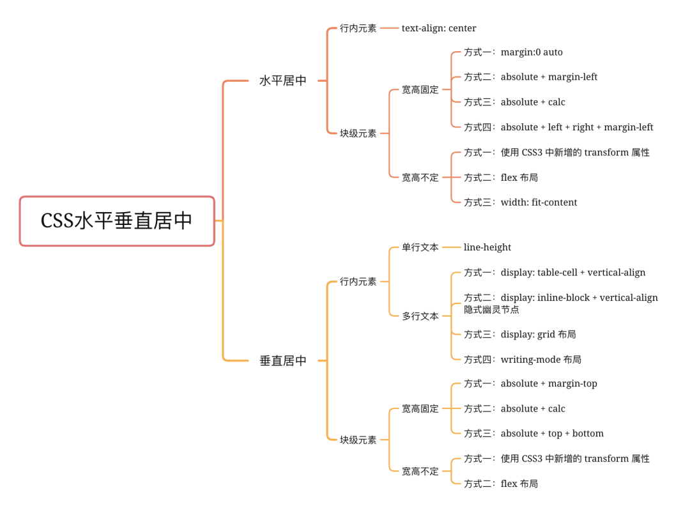

# [面试](../.)

## 常见的垂直水平居中布局


标签分为块级标签和行内标签(可替换标签不考虑)， 外层标签只能是块级元素，则一共 2 中情况， 即

- 行内标签相当于块级标签垂直水平居中， 具体情况如下：

1. 父元素宽高固定，一行文字垂直水平居中

```css
.parent {
  text-align: "center";
  line-height: [当前高度];
}
```

2. 父元素宽高不固定，一行文字垂直水平居中  
   2.1 父元素高度是这行文字撑开，那么自身就是垂直居中

```css
.parent {
  text-align: "center";
}
```

2.2 父元素高度由设置百分比撑开(`line-height`的百分比是根据自身字体大小)

```css
/**使用table实现垂直居中 */
.parent {
  display: table; /** 宽度不会充满整行 */
  width: 100%;
}
.child {
  display: table-cell;
  vertical-align: middle;
}
/**使用grid实现垂直居中 */
.parent {
  display: grid;
}
.child {
  margin: auto;
}
/**使用write-mode */
/**只能实现垂直居中 */
.parent {
  write-mode: vertical-lr;
}
.child {
  write-mode: horizontal-tb;
}
```

3. 父元素宽高固定，多行文字垂直水平居中  
   **同上**
4. 父元素宽高不固定，多行文字垂直水平居中  
   **同上**

- 块级标签相当于块级标签垂直水平居中

1. 父元素宽高固定， 子元素宽高固定  
   **使用 grid 布局**

```css
/**使用定位实现 */
.parent {
  position: relative;
}
.child {
  postion: absolute;
  top: 50%;
  left: 50%;
  margin-top: -[子元素高度的一半]
  margin-left: -[子元素宽度的一半]
}
```

2. 父元素宽高不固定， 子元素宽高固定

```css
/**使用定位 */
.parent {
  position: relative;
}
.child {
  position: absolute;
  top: 0;
  bottom: 0;
  left: 0;
  right: 0;
  margin: auto;
}
/**使用grid布局 */
.parent {
  display: grid;
}
.child {
  margin: auto;
}
```

3. 父元素宽高固定，子元素宽高不固定  
   **可使用`grid`布局**
   ```css
   /**使用定位 */
   .parent {
     postion: relative;
   }
   .child {
     top: 50%;
     left: 50%;
     transform: translate(-50%, -50%);
   }
   ```
4. 父元素宽高不固定，子元素宽高不固定  
   **跟上面一样**

---

总结： grid 布局可以实用所有的情况

## `flex：1`是那些属性，对应的属性代表什么含义

## Flex 布局中`flex-basis`与 width 有何区别？

1. `flex-basis`: 用来设置占据主轴空间的大小, 直接设置具体数值时，元素的宽度基本等于这个数值
2. 当`flex`布局子元素，在主轴方向上，超过父元素，`flex-basis`会自动调整
3. 在`flex-direction: row`时,`flex-basis`的优先级会高于`width`。同理，主轴为`column`时，`flex-basis`的优先级会高于`height`

## css 加载会阻塞 DOM 树的解析和渲染吗？

css 加载会直接影响网页的渲染，因为只有 css 加载完毕，构建完 cssom 之后，渲染树(Render Tree)才会构建，然后渲染位图

## 请简介 css 的盒子模型？

css 的盒子模型主要包含两种，通过`box-sizing`属性进行配置

- `content-box`: 默认属性，width 只包含 content
- `border-box`: width 包含 content、padding、border

## 如何实现三列均分布局?

1. flex 布局
2. grid 布局

## grid 布局的优势在哪？

flex 布局是轴线布局，只能指定 item 针对轴线的位置，可以看作是一维布局；grid 布局则是将容器划分为“行”和“列”，产生单元格，可以看作是二维布局。  
grid 布局，在响应式布局中，更加友好

## line-height 的取值分别取[2, 2em, 200%]有什么区别

`line-height`是相当于元素自身的字体的大小来取值，但同时会被继承。  
取值`2em`或者`200%`有可能遇到未预测的内容。  
比如：

- 父元素：`font-size: 18px; line-height: 2em(150% 同理)`,它的 lineheight 计算 lineheight 计算下来为 27px, 同时 2em 会被子元素继承
- 子元素: `font-size: 30px`, 子元素的 line-height 被继承为 27px，这样就会**出问题**
  取值 2 时，子元素继承值为 2
- 父元素：`font-size: 18px; line-height: 2`
- 子元素: `font-size: 30px`, 子元素的 line-height 被继承为 2,lineheight 计算为`60px`

## rem、em、vw、vh 各是什么意思？

rem: 根据根元素(即 html)的`font-size`
em: 在 font-size 中使用是相对于父元素的字体大小，在其他属性中使用是相当于自身的字体大小，如 width  
vw: viewport width  
vh: viewport height

## css 如何实现固定长宽比的元素

过去的实现方案使用`padding`,一个元素的`padding`若设置为百分比，则代表是以父元素的宽度为基准。根据这个原理可设置长宽比。但是，实际意义有限，毕竟 padding 会占据 content 的空间  
现在的解决方案，使用 aspect-ratio
